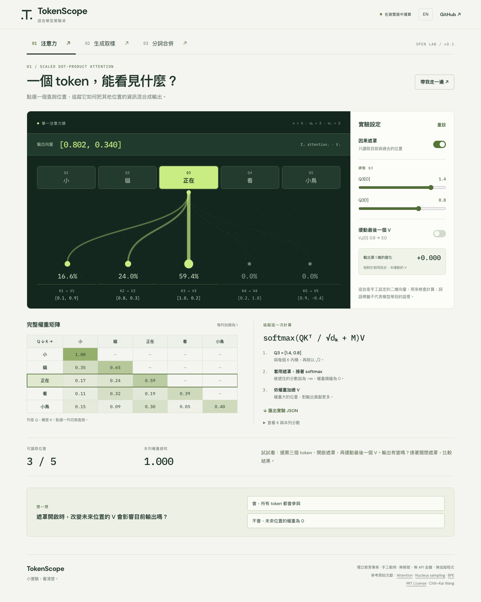

# TokenScope

**Change one condition. See the arithmetic change.**

A small, bilingual laboratory for three language-model mechanics: causal attention, token sampling, and BPE. Runs entirely in the browser with synthetic examples, inspectable numbers, and JSON exports. No account, model API, or analytics.

[Open the lab](https://f0909172434.github.io/tokenscope/?lang=en) · [繁體中文](README.zh-Hant.md) · [Mathematical conventions](docs/MATH.md)



## Three experiments

| Experiment    | Change                                                                   | Inspect                                                                                        |
| ------------- | ------------------------------------------------------------------------ | ---------------------------------------------------------------------------------------------- |
| **Attention** | Query vectors, selected position, causal mask, future-value perturbation | Signal paths, full weight matrix, raw scores, weighted output, exact perturbation delta        |
| **Sampling**  | Logits, temperature, top-k, top-p, uint32 seed                           | Before/after probabilities, entropy, candidate count, reproducible independent draws           |
| **BPE**       | English, Traditional Chinese, overlap example, or a custom corpus        | Frequency-weighted pair counts, individual merges, undo, symbol counts, complete merge history |

Every experiment includes a short concept check and exports its current inputs and computed results. Import an existing JSON export to restore its controls and recompute the results. Language switching and tab changes preserve experiment state until the page reloads. The URL remembers the language and active tab, not your experiment inputs.

### Try this first

1. Open **Attention** and select the third query token.
2. Leave **Causal mask** on and enable **Perturb the last V**. The output stays unchanged.
3. Disable the mask. The future position now contributes, and the output changes.
4. Export the experiment to inspect the exact vectors and weights.

## Run locally

Use Node.js **22.12+** (Node 24 also works).

```sh
git clone https://github.com/f0909172434/tokenscope.git
cd tokenscope
npm ci
npm run dev
```

Open the local URL printed by Vite. To serve a production build:

```sh
npm run build
npm run preview
```

The release includes a prebuilt static ZIP. Extract it and serve the directory with any static HTTP server, for example `python3 -m http.server 8080`. Opening `index.html` directly through `file://` is not supported. Fonts are bundled locally; the running lab fetches no external APIs or font services. Initial installation requires access to npm.

## Verify

```sh
npm test                         # numerical, algorithm, and replay validation tests
npm run build                    # strict TypeScript + production bundle
npx playwright install chromium
npm run test:e2e                  # desktop + mobile Chromium
npm run format:check
```

The browser suite covers real control interactions, seeded replay, stale-result clearing, Unicode/empty corpora, downloads, language switching, keyboard tab navigation, overflow checks, and automated axe checks in both languages. Mobile tests emulate an iPhone viewport in **Chromium**, not Safari. Automated accessibility checks do not establish full WCAG conformance.

GitHub Actions runs the same tests before deploying the static build to Pages. Pull requests run validation without deployment.

## Scope and limitations

- **Attention:** one self-attention head with five positions and hand-set two-dimensional Q/K/V vectors. There are no learned embeddings, positional encodings, training, residual connections, or full Transformer blocks. Word labels are illustrative; weights do not establish a linguistic explanation.
- **Sampling:** independent draws from fixed logits. The context is not updated between draws, so the displayed token sequence is not autoregressive language generation. Filtering order is documented explicitly rather than assumed to match every provider.
- **BPE:** word-based Unicode code-point BPE, without whitespace tokens or an end-of-word marker. It demonstrates the merge rule, not a production GPT byte-level tokenizer. The UI accepts 2,000 UTF-16 code units and up to 50 merges; the reusable core allows 20,000 code units. Pair counts include overlaps, while replacement is non-overlapping.
- **State:** local in-memory state only; refresh resets the experiments. Exports are plain JSON and contain the corpus or settings you entered. Use the import control to replay a saved experiment; all outputs are recomputed. See [replay limits and compatibility](docs/REPLAY.md).

## Project structure

```text
src/core/          Pure attention, sampling, and BPE functions + unit tests
src/components/    Three labs and shared accessible controls
src/App.tsx        Language and experiment navigation
src/style.css      Responsive workbench design and reduced-motion support
e2e/               Playwright interaction and accessibility checks
docs/              Conventions, design notes, and screenshots
```

React, TypeScript, and Vite; no numerical runtime library is required. The pure functions can be reused separately from the interface.

## References

- Vaswani et al. (2017), [Attention Is All You Need](https://arxiv.org/abs/1706.03762), scaled dot-product attention and autoregressive masking.
- Holtzman et al. (2020), [The Curious Case of Neural Text Degeneration](https://arxiv.org/abs/1904.09751), nucleus sampling.
- Sennrich, Haddow, and Birch (2016), [Neural Machine Translation of Rare Words with Subword Units](https://arxiv.org/abs/1508.07909), BPE for subword segmentation. This lab omits several production preprocessing details, including end-of-word markers.

An independent educational project; not affiliated with Stanford or any model provider.

## Contributing and license

See [CONTRIBUTING.md](CONTRIBUTING.md). Code and original educational copy are released under the [MIT License](LICENSE). Bundled fonts retain their SIL Open Font Licenses; see [third-party notices](docs/THIRD_PARTY.md).
